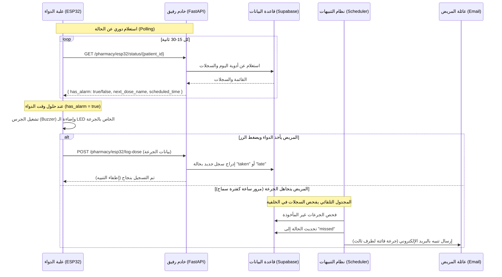

# رفيق (Rafiq) — AI-Powered Clinical & IoT Companion 🩺

> **"رفيقك الذكي، دائمًا بجانبك ورعايتك."**

**رفيق (Rafiq)** هو نظام برمجيات متكامل يمثل **مساعدًا سريريًا شخصيًا ذكيًا** للمرضى الذين يعانون من أمراض مزمنة (مثل السكري، ضغط الدم، واضطرابات الغدد الصماء). لا يهدف النظام إلى استبدال الطبيب، بل يملأ الفجوة الكبيرة بين الزيارات السريرية من خلال تقديم إرشادات طبية فورية، وإدارة ذكية ومؤتمتة للأدوية، ومراقبة صحية استباقية على مدار الساعة عبر دمج الذكاء الاصطناعي مع **علبة الدواء الذكية (IoT Smart Pillbox)**.

تم تصميم هذا المستند لشرح فكرة النظام، وهندسته البرمجية، وآلية عمل علبة الدواء الذكية، وتفاصيل النشر في بيئة الإنتاج (Production)، ليكون مرجعاً أساسياً للفريق لكتابة التوثيق التفصيلي (Documentation).

---

## 📌 الفكرة العامة ورؤية النظام (The Core Concept)

يعاني مرضى الأمراض المزمنة من تحديات يومية مستمرة:
1. **صعوبة الالتزام بمواعيد الأدوية الدقيقة**، مما يؤدي لجرعات فائتة أو تداخلات دوائية خطيرة.
2. **غياب المتابعة المستمرة بين المريض وعائلته**، فلا يعلم الأهل إن كان المريض قد التزم بجرعته أم لا.
3. **صعوبة تفسير الأعراض الفورية**؛ حيث يحتاج المريض لمعرفة ما إذا كان العَرَض طارئاً أم طبيعياً دون الانتظار لزيارة الطبيب القادمة.

يحل **رفيق** هذه المشاكل عبر منظومة مترابطة:
* **العقل السريري (Clinical AI Brain):** نظام معتمد على وكلاء ذكاء اصطناعي متعددين (Multi-Agent System) يستقبل استفسارات المريض ويحللها بناءً على ملفه الطبي الفعلي.
* **علبة الدواء الذكية (IoT Smart Pillbox):** جهاز ملموس يعتمد على متحكم ESP32، يرتبط بالخادم السحابي مباشرة لينبه المريض للجرعة ويسجل أخذ الدواء في قاعدة البيانات بمجرد ضغط زر على العلبة.
* **نظام التنبيهات التلقائي (Background Scheduler):** يعمل في الخلفية لمراقبة التزام المريض، وإرسال تنبيهات بريدية فورية لعائلته في حال تفويت الجرعة لتدارك الموقف.

---

## 🧠 الهيكل الإنشائي للنظام (System Architecture)

تتكون البنية التحتية لنظام رفيق من ثلاثة مكونات رئيسية تعمل بانسجام تام:

```
                  ┌─────────────────────────────────────────┐
                  │          تطبيق الهاتف (Mobile App)      │
                  └────────────────────┬────────────────────┘
                                       │ (REST API & Auth)
                                       ▼
                  ┌─────────────────────────────────────────┐
                  │       خادم الخلفية (FastAPI Server)     │
                  └──────────┬───────────┬───────────┬──────┘
                             │           │           │
            ┌────────────────┘           │           └────────────────┐
            ▼ (Vector Queries)           ▼ (Auth & DB)                ▼ (IoT Sync)
┌───────────────────────┐    ┌───────────────────────┐    ┌───────────────────────┐
│     Qdrant DB         │    │      Supabase         │    │  علبة الدواء الذكية   │
│ (الذاكرة السريرية)   │    │ (البيانات والمستخدمين)│    │   (ESP32 Pillbox)     │
└───────────────────────┘    └───────────────────────┘    └───────────────────────┘
```

### 1. العقل السريري المتعدد الوكلاء (Multi-Agent Clinical Brain)
عندما يرسل المريض رسالة نصية (مثل: "أشعر بدوار خفيف وقست السكر فكان 250")، يمر الطلب بالمراحل التالية:
1. **الموجه والمصنف (Orchestrator):** يحلل نية المريض (Intent Classification)، ويسترجع ملفه الطبي من قاعدة البيانات، ويحدد التخصصات المطلوبة.
2. **الوكلاء المختصون (Specialist Agents):** يتم تشغيل الوكلاء بالتوازي حسب الحاجة:
   * **وكيل السكري (Diabetes Agent):** يحلل قراءات الجلوكوز ويقدم نصائح مخصصة.
   * **وكيل ضغط الدم (Blood Pressure Agent):** يتابع قراءات الضغط الانقباضي والانبساطي.
   * **وكيل الغدد (Endocrine Agent):** يتابع الهرمونات ووظائف الغدة الدرقية.
   * **وكيل الصيدلة (Pharmacy Agent):** مسؤول عن جدولة الأدوية وفحص التفاعلات وتدقيق الوصفات عبر صور الـ OCR.
3. **الملخص (Synthesizer):** يجمع ردود الوكلاء المختلفين ويوحدها في رد واحد متسق، ودود، وخالٍ من التعارض، ليُرسل للمريض.

---

## 📡 علبة الدواء الذكية والربط البرمجي (IoT Pillbox Integration)

تمثل علبة الدواء الذكية (المبنية على **ESP32**) الجسر الفيزيائي الذي يضمن التزام المريض. صُممت نقاط الاتصال (API Endpoints) لتكون خفيفة ومباشرة لتناسب قدرات المتحكمات الدقيقة.

### 🔄 دورة حياة التفاعل بين العلبة والخادم (IoT Flow)



### 🔌 نقاط الاتصال المخصصة للـ IoT (Endpoints Details)

#### 1. جلب حالة الإنذار والجرعة القادمة
* **الرابط:** `GET /api/v1/pharmacy/esp32/status/{patient_id}`
* **الهدف:** يتيح للمتحكم (ESP32) معرفة ما إذا كان هناك منبه نشط يجب تشغيله حالياً (لأن وقته قد حان ولم يُسجل كمأخوذ بعد)، أو معرفة تفاصيل الجرعة القادمة لعرضها على شاشة العلبة.
* **نموذج الاستجابة (Response):**
  ```json
  {
    "has_alarm": true,
    "next_dose_name": "Metformin",
    "next_dose_time": "08:00",
    "medication_id": "uuid-here",
    "scheduled_time": "08:00:00"
  }
  ```

#### 2. تسجيل أخذ الجرعة مباشرة من العلبة
* **الرابط:** `POST /api/v1/pharmacy/esp32/log-dose`
* **الهدف:** يتيح للعلبة إرسال إشارة تأكيد فورية عند ضغط المريض على الزر الفيزيائي.
* **ملاحظة أمنية وتصميمية:** لا يتطلب هذا المسار رمز JWT معقداً لتسهيل عملية التطوير على متحكم الـ ESP32؛ حيث يتم التحقق من خلال معرف المريض ومعرف الدواء مباشرة.
* **الحساب التلقائي للحالة:** يقوم النظام بمقارنة وقت الاستدعاء الفعلي بالوقت المجدول؛ فإذا كان ضمن ساعة (60 دقيقة) قبل أو بعد الوقت المحدد تُسجل الحالة كـ `taken`، وإذا تجاوزها تُسجل كـ `late`.
* **نموذج الطلب (Request Payload):**
  ```json
  {
    "patient_id": "uuid-of-patient",
    "medication_id": "uuid-of-medication",
    "scheduled_time": "08:00:00"
  }
  ```

---

## 🛠️ تفاصيل بيئة الإنتاج والتشغيل (Production Environment)

يتم تشغيل تطبيق رفيق في بيئة الإنتاج بالاعتماد على البنية التحتية التالية لضمان الاستقرار والسرعة:

### 1. المنصة السحابية (Railway Deployment)
تتم استضافة خادم FastAPI على منصة **Railway**، حيث يتم البناء تلقائياً من مستودع GitHub بناءً على ملف `Procfile` الذي يحدد نقطة الانطلاق وأمر التشغيل:
```procfile
web: uvicorn app.main:app --host 0.0.0.0 --port $PORT
```
*يتم توجيه المنفذ (Port) تلقائياً عبر متغيرات البيئة الخاصة بمنصة الاستضافة.*

### 2. البنية التحتية للبيانات والخدمات السحابية (Cloud Infrastructure)
* **قاعدة البيانات (Supabase):** تستخدم لتخزين بيانات المرضى، ملفاتهم الطبية، قراءات المؤشرات الحيوية، والأدوية وجدولتها اليومية وسجلاتها التاريخية. كما تُستخدم نظام المصادقة (Supabase Auth) للتحقق من هوية المرضى عبر الـ JWT.
* **الذاكرة الدلالية (Qdrant Cloud):** قاعدة بيانات متجهة (Vector Database) تُخزن فيها المتجهات السريرية وتاريخ الحوارات لضمان توفير سياق سريري دقيق ومستمر للذكاء الاصطناعي (Semantic Memory).
* **محرك الذكاء الاصطناعي:** يتم الاعتماد على نموذج **Gemini 2.5 Flash** لتقديم إجابات سريعة وذكية وبتكلفة منخفضة، بالإضافة لمعالجة الصور لاستخراج بيانات الوصفات الطبية (OCR).

### ⏰ المهام المجدولة في الخلفية (Background Workers)
يعتمد التطبيق على مكتبة `APScheduler` مدمجة مع دورة حياة التطبيق (`FastAPI Lifespan`)، وتقوم بمهام حيوية في الخلفية:
1. **فحص الالتزام بالأدوية (Missed Doses Checker):** يعمل **كل 15 دقيقة** بشكل تلقائي ومستمر. يقوم بالمرور على جميع المرضى ومقارنة أوقات جرعاتهم الحالية بسجلات أخذ الدواء لليوم؛ وإذا اكتشف تفويت الجرعة وتجاوز فترة السماح (60 دقيقة)، يقوم بـ:
   * تسجيل الجرعة في قاعدة البيانات بالحالة `missed`.
   * إرسال بريد إلكتروني فوري ومصمم بشكل مميز للأهل أو جهة الاتصال الطارئة للمريض لتنبيههم بضرورة الاطمئنان عليه.
2. **إبقاء الخدمات نشطة (Qdrant Keep-Alive):** تعمل مهمة في الخلفية **كل 24 ساعة** لعمل Ping لقاعدة البيانات المتجهة Qdrant لضمان عدم دخول العنقود (Cluster) في وضع الخمول (Sleep Mode) في النسخ المجانية.

---

## 📁 الهيكل التنظيمي للملفات (Project Structure)

```
rafiq_backend/
├── app/
│   ├── agents/
│   │   ├── clinical/           # وكلاء الذكاء الاصطناعي السريري (السكري، الضغط، الغدد)
│   │   ├── functional/         # وكيل الصيدلة (تحليل الأدوية، التفاعلات، الجدولة)
│   │   ├── tools/              # الأدوات المشتركة للوكلاء
│   │   └── orchestrator.py     # العقل المدبر والموجه للمحادثة والملخص
│   ├── api/
│   │   ├── routes/             # مسارات الـ API (المصادقة، المحادثة، الصيدلة والـ IoT، التقارير)
│   │   └── router.py           # المجمع العام للمسارات
│   ├── core/                   # الإعدادات العامة، الحماية، وإعداد المجدول في الخلفية
│   ├── db/                     # الاتصال بقواعد البيانات (Supabase & Qdrant)
│   ├── schemas/                # نماذج التحقق وتدقيق البيانات المدخلة والمسترجعة (Pydantic)
│   ├── services/               # منطق الأعمال (البريد الإلكتروني، إرسال التنبيهات، مهام الخلفية)
│   └── main.py                 # نقطة الدخول الرئيسية للتطبيق وإدارة دورة الحياة (Lifespan)
├── .env.example                # نموذج لمتغيرات البيئة المطلوبة
├── Procfile                    # ملف تعريف أمر التشغيل للإنتاج (Railway)
└── requirements.txt            # المكتبات والاعتماديات المطلوبة للمشروع
```

---

## ⚙️ المتغيرات البيئية المطلوبة للإنتاج (Required Env Variables)

لضمان عمل النظام بشكل كامل في بيئة الإنتاج، يجب ضبط المتغيرات التالية في لوحة تحكم الاستضافة:

| المتغير | الوصف | مثال |
|---|---|---|
| `GEMINI_API_KEY` | مفتاح الاتصال بنموذج ذكاء اصطناعي من Google AI Studio | `AIzaSy...` |
| `SUPABASE_URL` | رابط مشروع Supabase الخاص بك | `https://xxxx.supabase.co` |
| `SUPABASE_KEY` | مفتاح الخدمة لـ Supabase (Service Role Key) للوصول الإداري | `eyJhbGci...` |
| `QDRANT_URL` | رابط الوصول لعنقود Qdrant | `https://xxxx.gcp.qdrant.io` |
| `QDRANT_API_KEY` | مفتاح الوصول لقاعدة بيانات Qdrant | `xxxxxx...` |
| `SMTP_HOST` | خادم إرسال البريد الإلكتروني للتنبيهات | `smtp.gmail.com` |
| `SMTP_PORT` | منفذ خادم البريد | `587` |
| `SMTP_USERNAME` | بريد إرسال التنبيهات | `alerts@rafiq.com` |
| `SMTP_PASSWORD` | كلمة مرور التطبيق (App Password) للبريد | `xxxx xxxx xxxx xxxx` |

---

*تم إعداد هذا الدليل ليوضح الترابط بين الجانب السريري للذكاء الاصطناعي وجانب الـ IoT المتمثل في علبة الدواء الذكية وكيفية معالجتها في خادم الإنتاج.*